# Galgje

Hallo! Vandaag gaan we het spel *galgje* maken, op de computer.

Op de computer kan je zelf dingen maken door het in *code* te typen. Dat noemen we ook wel *programmeren*. Wij gaan het spel *galgje* programmeren.

Het is moeilijk om dat helemaal zelf te leren. Daarom hebben de begeleiders van de CoderDojo Enschede alvast een begin gemaakt. Hieronder vind je instructies waarmee je stap voor stap aan de slag kan.

Elke opdracht bevat uitleg, en dingen die jij zelf moet doen. De dingen die jij zelf moet doen, staan aangegeven met `▶▶▶`.

Als je helemaal klaar bent, zal het eindresultaat er ongeveer zo uit zien: https://coderdojoenschede.github.io/galgje/.

### Opdracht 0: Openen van programmeeromgeving

De code staat in Trinket. Dat is een website waarop je kan programmeren, en direct het resultaat kan bekijken.

▶▶▶ Open Trinket door op de link te klikken: https://trinket.io/embed/html/374cf849e6

Je moet nu aan de linker kant code zien, en aan de rechter kant het galgje spel.

Als je aan de linker kant de code aanpast, dan verandert de website automatisch na een paar seconden aan de rechterkant.

Dat was gemakkelijk! Nu komt het echte werk!

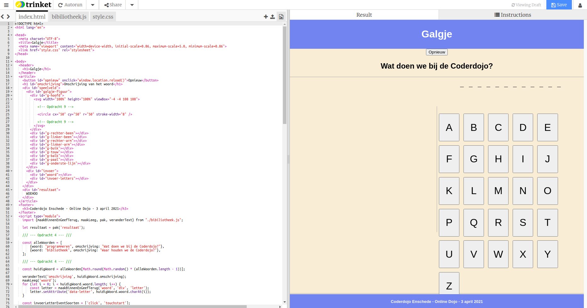

### Opdracht 1: Alle letters van het alfabet

Is je al opgevallen dat er knoppen staan voor de letters `A`, `B` en `C`? Waar is de rest van het alfabet gebleven? We hebben alle 26 letters van het alfabet nodig om galgje te spelen.

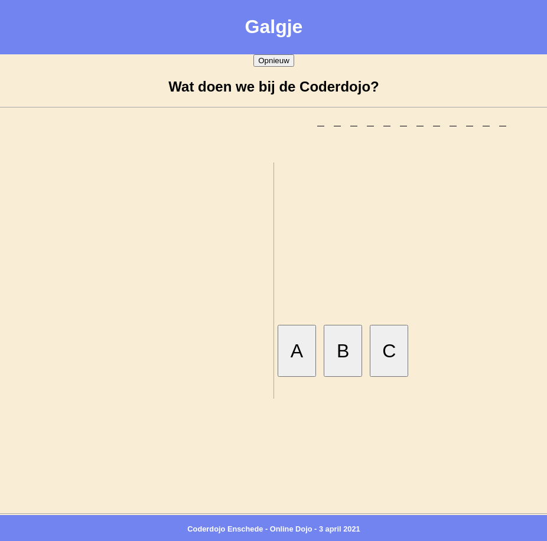

▶▶▶ Kijk aan de linker kant in `galgje.js`. Er staat 'Opdracht 1' in het midden.

Daar staat een lijstje van mogelijke letters. Alleen `A`, `B` en `C` staan erin.

▶▶▶ Vul het lijstje aan met alle andere letters. In totaal moeten er 26 letters in het lijstje staan.

Zorg dat elke letter tussen twee apostrofs (`'`) staat, en een hoofdletter is (`D`, niet `d`). Tussen elke letter moet een komma (`,`) staan.

▶▶▶ Controleer dat aan de rechterkant 26 knoppen met letters zijn.

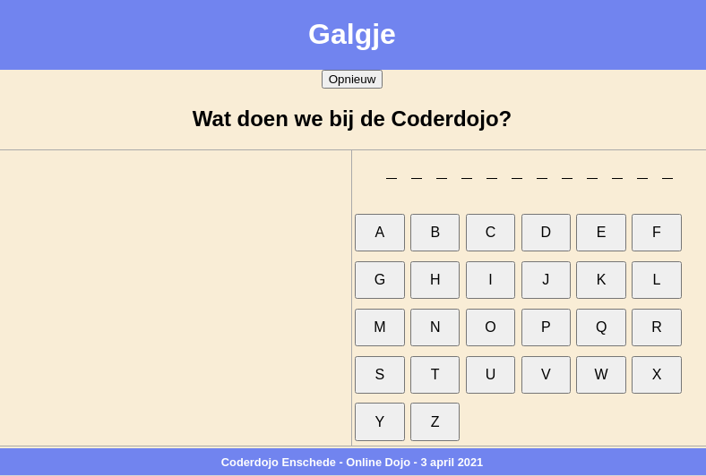

Goed zo! We kunnen nu letters klikken om het woord te raden.

### Opdracht 2: Letters laten verschijnen

▶▶▶ Klik op een letter.

Er gebeurt niet zoveel... De letter wordt alleen rood, alsof hij fout is.

▶▶▶ Klik op een andere letter.

Er gebeurt nog steeds niet zoveel. De letter wordt ook rood.

Geen enkele letter wordt groen als hij goed is. Laten we dat gaan maken.

▶▶▶ Ga naar in `galgje.js` aan de linker kant. Er staat 'Opdracht 2'.

▶▶▶ Verander `const letterIsGoed = false;` naar `const letterIsGoed = letterGekozen(letter);`.

▶▶▶ Klik op een aantal letters.

Nu gebeurt er iets! Voor goede letters verschijnen ze in het woord. Voor foute letters verschijnen er onderdelen van de galg.

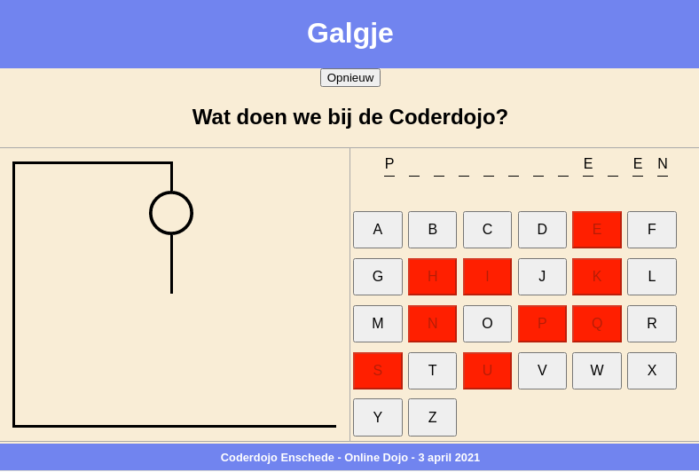

### Opdracht 3: Letters laten controleren

▶▶▶ Kijk in `galgje.js` aan de linker kant. Er staat 'Opdracht 3'.

In dit stukje code staat `if`. Dat betekent dat als de letter goed is, de code op regel 117 wordt uitgevoerd, en als de letter fout is de code op regel 119 wordt uitgevoerd.

Op beide regels wordt `'fout'` gezet, waardoor de knop rood wordt!

▶▶▶ Zorg ervoor dat als de letter goed is (de code in regel 116), er `'goed'` wordt gezet in plaats van `'fout'`.

▶▶▶ Klik een aantal letters aan. Als je een goede letter raadt, moet de letter groen worden

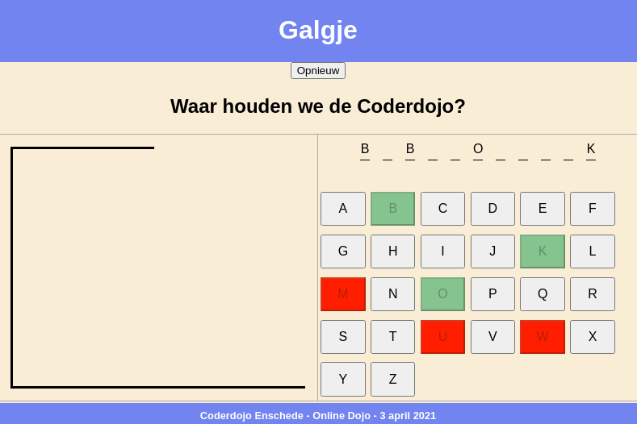

### Opdracht 4: Meer woorden

▶▶▶ Kijk in `galgje.js` aan de linker kant. Er staat 'Opdracht 4'.

Tot nu toe wordt er een lijstje gebruikt van twee mogelijke woorden. Dat is saai. Gelukkig kunnen we met code extra woorden erbij maken!

▶▶▶ Voeg een woord toe, onder `"programmeren"` en `"bibliotheek"`. Zorg dat de regel er net zo uit ziet als de andere regels in het lijstje: `{woord: "...", omschrijving: "..." },`. Elke regel moet eindigen met een komma (`,`).

Aan de rechterkant moet nu af en toe jouw nieuwe woord(en) verschijnen. Het spel kiest een willekeurig woord uit het lijstje.

▶▶▶ Klik een aantal keer op de knop `Opnieuw` in het Galgje spel, net zolang totdat jouw woord voorbij komt. Raad met de knoppen met letters jouw eigen woord.

---

Vanaf dit moment moet je een werkend spel hebben. Goed gedaan!

▶▶▶ Probeer een aantal keer een woord te raden. Is er familie of een vriend(in) in de buurt? Vraag hen ook om een woord te raden.

---

### Opdracht 5: Altijd winnen

Laten we vals spelen. Jij kan de code aanpassen zodat je altijd wint, welke letter je ook kiest.

▶▶▶ Kijk in `galgje.js` aan de linker kant. Er staat 'Opdracht 5'. Voeg de regel `gewonnen();` toe. Na elke ingevoerde letter heb je nu gewonnen!

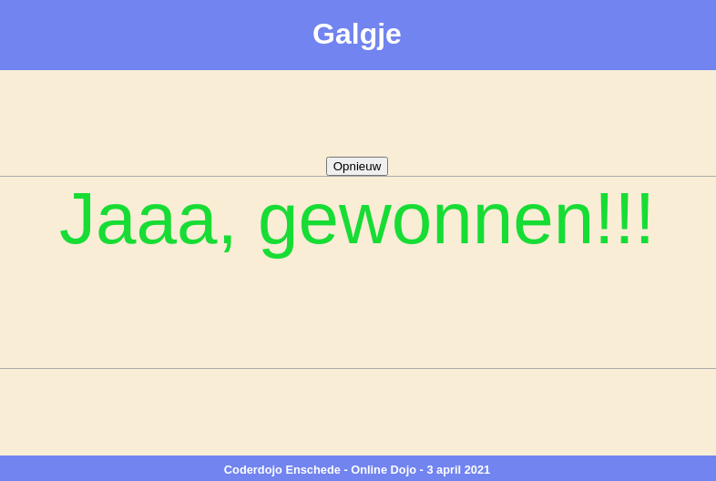

Het stukje code `gewonnen();` noemen we een functie. Omdat er haakjes `()` achter staan, *doet* het iets. In dit geval zorgt de regel code ervoor dat je hebt gewonnen.

Het kan ook anders. We kunnen ook na elke letter automatisch hebben **verloren**. Hoe zou die functie heten?

▶▶▶ Wijzig de regel die je net hebt aangepast naar een andere functie die ervoor zorgt dat je het spel verliest.

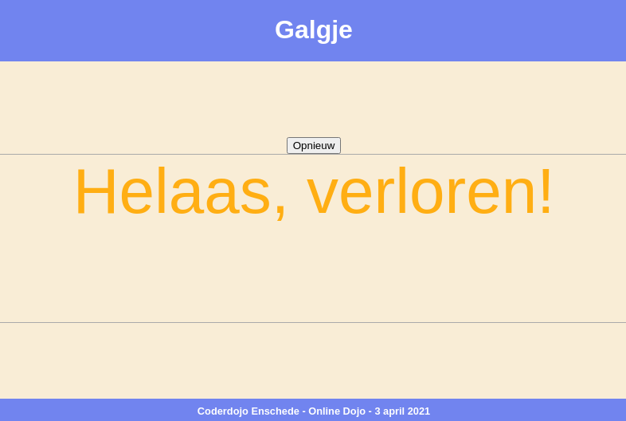

Dat is mooi! Maar het spelletje is wel een beetje saai geworden zo.

▶▶▶ Maak je wijzigingen van deze opdracht ongedaan zodat je weer letters kunt invoeren zonder direct te winnen of te verliezen.

### Opdracht 6: De volgorde veranderen

Als je een foute letter invoert, dan komen een voor een de onderdelen van de galg tevoorschijn. Laten we de volgorde aanpassen.

▶▶▶ Kijk in `galgje.js` aan de linker kant. Er staat 'Opdracht 6'. Daar staat een lijstje `figuurOnderdelen` met onderdelen van de galg.

Kan je ontdekken welke namen in het lijstje bij welke onderdelen horen?

Probeer een aantal letters fout te raden, en kijk goed welke onderdelen verschijnen.

▶▶▶ Verwissel twee of meer onderdelen van plek. Raad een aantal foute letters. De onderdelen moeten nu in een andere volgorde verschijnen.

Je mag zelf kiezen of de je volgorde zo laat, of dat je de volgorde weer terugzet naar hoe het eerst was.

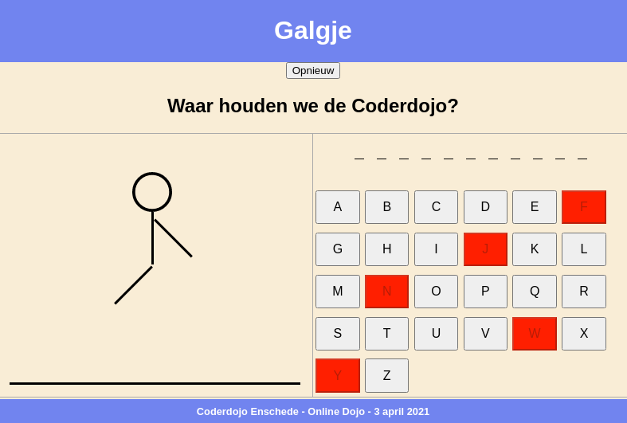

### Opdracht 7: Kleuren aanpassen

Tot nu toe zijn we bezig geweest in het bestand `galgje.js` aan de linker kant. Er zijn meer bestanden die we kunnen aanpassen.

▶▶▶ Open aan de linkerkant het bestand `style.css`.

Het bestand `style.css` bevat stijlen. Die bepalen hoe het spel eruit ziet.

Wij gaan de kleuren van de onderdelen van het spel aanpassen.

▶▶▶ Ga naar 'Opdracht 7' in `style.css`. Pas de regel waar `background-color: cornflowerblue;` staat aan naar een andere kleur achter de `:`, bijvoorbeeld `red` (rood), `green` (groen), `yellow` (geel), `black` (zwart), `white` (wit) of `purple` (paars).

Je moet nu aan de rechterkant de kleur van de balk boven en onder het spel zien veranderen.

▶▶▶ Eronder staat een regel `color: white;` Die regel past de kleur van de tekst aan. Probeer hier ook een aantal kleuren.

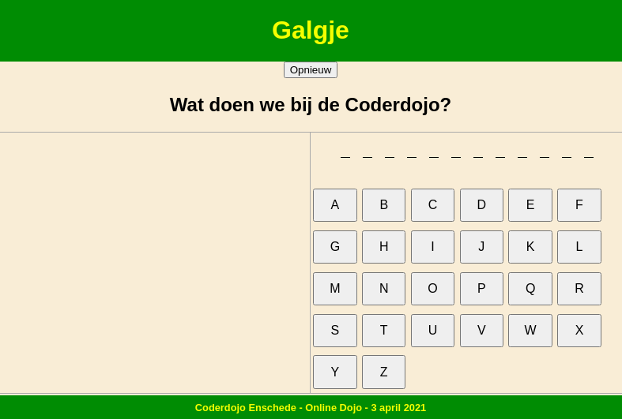

### Opdracht 8: Meer kleuren aanpassen

We kunnen nog meer kleuren aanpassen.

▶▶▶ Ga naar 'Opdracht 8' in `style.css`. Pas de regel waar `background-color: red;` staat aan naar een andere kleur achter de `:`. Je kan uit de zelfde kleuren kiezen als de vorige opdracht.

Raad een aantal foute letters. Je ziet nu dat de galg een andere kleur heeft.

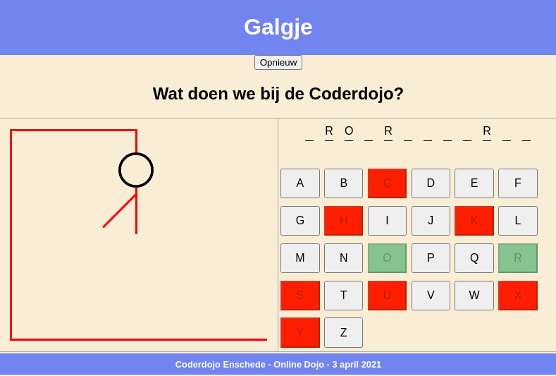

### Opdracht 9: Ogen en mond

Laten we het figuur ogen en een mond geven.

▶▶▶ Ga naar 'Opdracht 9' in `index.html`.

Je ziet hier `<circle>...</circle>` staan. Het woord `circle` maakt een cirkel. Er staat `cx` en `cy` in, dat zijn de *coordinaten* van het centrum (centrum X en centrum Y). Er staat ook nog een `r` in, dat is de *radius*, hoe groot de cirkel is.

▶▶▶ Voeg nog twee cirkels toe:

    <circle cx="35" cy="40" r="..." stroke-width="8"></circle>
    <circle cx="65" cy="40" r="..." stroke-width="8"></circle>

Vul zelf op de plek van de `...` een getal tussen de 0 en de 100 in totdat de ogen er goed uit zien.

▶▶▶ Een mond kan je maken met `<line x1="..." y1="..." x2="..." y2="..." stroke-width="8"></line>`. Vul zelf op de plek van de `...` een getal tussen de 0 en de 100 in, totdat de mond er goed uit ziet.

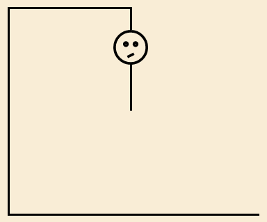
